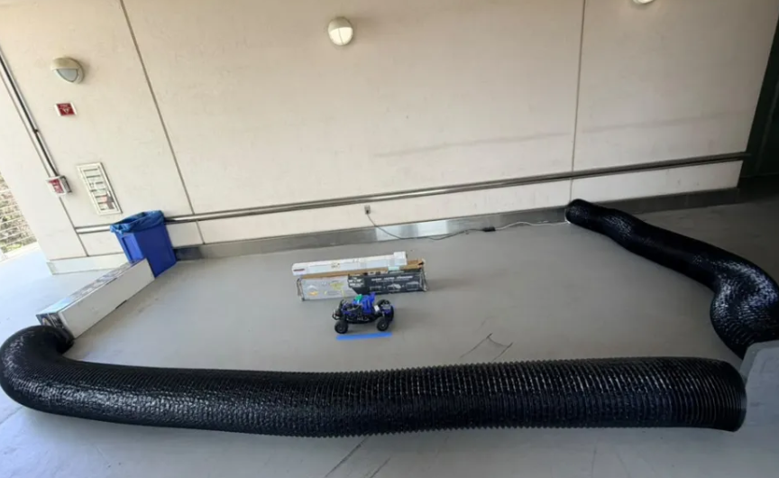

# Physical Setup Guidelines

How the car and test track are arranged at UCSD. Read this before your first drive session.

**Related:** [03_CAR_CONNECT_AND_CONTAINER.md](03_CAR_CONNECT_AND_CONTAINER.md) (SSH + container) · [11_SAFETY_FAILSAFE_AND_COMPETITION_RULES.md](11_SAFETY_FAILSAFE_AND_COMPETITION_RULES.md) (safety tests)

---

## 1) The car

| Item | Detail |
|------|--------|
| **Name / hostname** | UCSD-Blue (`ucsd-blue.local`) |
| **Platform** | F1TENTH-scale 1/10 indoor RoboRacer |
| **Compute** | Raspberry Pi 5 on the car |
| **LiDAR** | Livox MID-360 (360° 3D LiDAR + IMU) |
| **Camera** | OAK-D W Pro (not used in main mapping pipeline) |
| **Motor controller** | VESC (USB → `/dev/ttyACM0`) |
| **RC receiver** | USB → `/dev/ttyACM1` (Arduino); joystick → `/dev/input/js0` |
| **Wheelbase** | 0.33 m (used in pursuit tuning) |

### Measured sensor heights (from floor)

| Part | Height |
|------|--------|
| LiDAR top | ~18 cm |
| LiDAR optical center | ~15 cm |
| Software uses 2D slice at roughly wall height | see §4 |

### LiDAR detectability box (competition rule)

Rear **12×12×20 cm** box may be required for multi-car events. See doc 11 for mounting rules.

---

## 2) Network and access

| Item | Value |
|------|--------|
| **Car Wi-Fi** | Join `ucsd_robocar` from your laptop (same network as the Pi) |
| **SSH** | `ssh ucsd-blue@ucsd-blue.local` |
| **Fallback** | `ssh ucsd-blue@<car_ip>` if `.local` fails — see [07_TROUBLESHOOTING.md](07_TROUBLESHOOTING.md) §1 |
| **Repo on car** | `~/roboracer-t7` (pull `docs/clean-handoff` branch before sessions) |

Ask the previous team or professor for Wi-Fi password if needed.

---

## 3) Power-on order (every session)

1. Turn **ON** RC transmitter.
2. Turn **ON** car battery / power.
3. Wait **20–60 seconds** for Pi boot.
4. Connect laptop to `ucsd_robocar`.
5. `ping ucsd-blue.local` then SSH.

**Power-off (reverse):** stop ROS → stop container → car power off → RC off last.

---

## 4) Current test track layout

We test on a **DIY mock track** in a covered corridor at UCSD (layout **can be changed** between sessions — rebuild and re-map if you move walls).

### Photo (June 2026 — current reference)



*File: `docs/images/physical_track_setup.png`*

Older layout sketches: `test_manual_map_new/cart_logs/ucsd_mock_racetrack_june3.jpeg`

### What you see in the photo

| Item | In the picture |
|------|----------------|
| **Robot** | Blue F1TENTH car (UCSD-Blue) on **blue tape** — this is the **start/finish line** |
| **Outer wall (right + front)** | Black **corrugated drainage pipe** (~30 cm tall), bent into a curve |
| **Outer wall (left)** | Blue recycling bin + long **white cardboard box** |
| **Back wall** | Fixed hallway wall with metal handrail |
| **Inner obstacle** | **Two stacked cardboard boxes** in the center (~20 cm tall) |
| **Floor** | Smooth light-gray concrete / linoleum — good for wheel odometry |
| **Drive path** | Loop around the inner boxes, staying between inner boxes and outer pipe/walls |
| **Approx. size** | ~3 m × 4.5 m (10 × 15 ft) in the photo; varies if you extend pipe |

### Shape (top-down)

Closed loop — **“O with a box inside”**:

```
  ┌─────────────────────────────────────┐
  │  outer hose wall (measured)         │
  │    ┌───────────────┐                │
  │    │  inner box    │  ← ~1.25×0.40 m│
  │    │  (measured)   │                │
  │    └───────────────┘                │
  │         ── racing line ──>          │
  └─────────────────────────────────────┘
```

| Element | Description |
|---------|-------------|
| **Outer boundary** | Black **corrugated pipe** + left-side **bin/box** + back **hall wall** |
| **Inner obstacle** | Stacked **cardboard boxes** (~1.25 m × 0.40 m footprint, ~20 cm tall) |
| **Driving corridor** | Stay **centered** between inner boxes and outer pipe/walls |
| **Start marker** | **Blue tape** on the floor — begin and end every mapping lap here |
| **Materials on hand** | Limited pipe length (~2 m sections) — track size is constrained |

### If you change the layout

1. Rebuild physical walls first (both sides must have obstacles — see below).
2. Re-record a **2–3 lap bag** on the car.
3. Re-run **offline de-drift** on the laptop.
4. Generate a new `traj_race_cl.csv` — old racelines will not match a new shape.

---

## 5) LiDAR height slice (walls vs floor)

The MID-360 is 3D, but our pipeline converts it to a 2D `/scan` ring. The **height slice** must hit the walls, not the floor:

| Setting | Value | File |
|---------|-------|------|
| `min_height` | `-0.08` m | `docker/config/pointcloud_to_laserscan_indoor.yaml` |
| `max_height` | `0.00` m (below 20 cm box step) | same |
| `range_max` | `2.5` m | same |

Applied on the car by `scripts/car_map_setup.sh` each container session.

**If maps look wrong:** inner box smeared → slice may be too high (reading floor). Outer ring overshoots room → slice may be too high. Do not change these without re-testing against `testrun/june7_set7/` reference.

---

## 6) RC controller and deadman

| Control | Detail |
|---------|--------|
| **Config file** | `config/joy_rc_steer_fix.yaml` |
| **Deadman button** | Index `1` — must be **held** to drive manually |
| **Steering scale** | 0.40 (reduced from 1.0 to avoid servo saturation) |

### Known mechanical issue

Car **pulls slightly right** on straight lines. Counter-steering while mapping adds noise to odometry. This is not a software, but a hardware issue. Ask TA to loosen the screws of the front wheels to resolve the counter-steering. 

RC Connection drops occasionally due to loosely secured the wires. Ask TA to proplery secure all connections.

---

## 7) USB device order on UCSD-Blue

| Device | Path | Role |
|--------|------|------|
| VESC (STM) | `/dev/ttyACM0` → `/dev/sensors/vesc` | Motor + wheel odometry |
| Arduino RC | `/dev/ttyACM1` | RC receiver |
| Joystick | `/dev/input/js0` | Same RC input to ROS |

Always symlink VESC before driving:

```bash
sudo ln -sf /dev/ttyACM0 /dev/sensors/vesc
```

(`car_map_setup.sh` does this automatically.)

---

## 8) Session checklist (physical)

- [ ] RC on, then car power on
- [ ] Laptop on `ucsd_robocar`
- [ ] SSH works
- [ ] Track built: inner stacked boxes + outer pipe/walls, closed loop (see §4 photo)
- [ ] Blue tape start line visible
- [ ] Battery charged (under LiPo, 4.2V, 4S Cells, and 4.0A)

Then proceed to [MAPPING_AND_RACELINE_GUIDE.md](MAPPING_AND_RACELINE_GUIDE.md) Part A.
